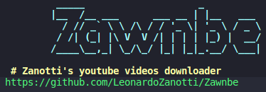

# Zawnbe
Zanotti's youtube videos downloader is a python program which reads a text file with links of youtube videos and then download these videos

## Requirements
Is necessary to have python 3.7 and pytube3 installed to run the program.
```bash
# To install pytube3 in python 3.7 run:
$ pip3 install pytube3
```

If you get "KeyError: 'cipher' you will need to go to the pytube folder.
For my case (linux), i go to `/home/{user}/.local/lib/python3.7/site-packages/pytube`.
In this folder, open the `extract.py` file and change `parse_qs(formats[i]["cipher"]) for i, data in enumerate(formats)` to `parse_qs(formats[i]["signatureCipher"]) for i, data in enumerate(formats)`

## Running
To use the program do:
```bash
# Clone the repository
$ git clone https://github.com/LeonardoZanotti/Zawnbe.git

# Enter the program folder
$ cd Zawnbe/

# Run the program
$ python3 zawnbe.py
```

### Leonardo Zanotti